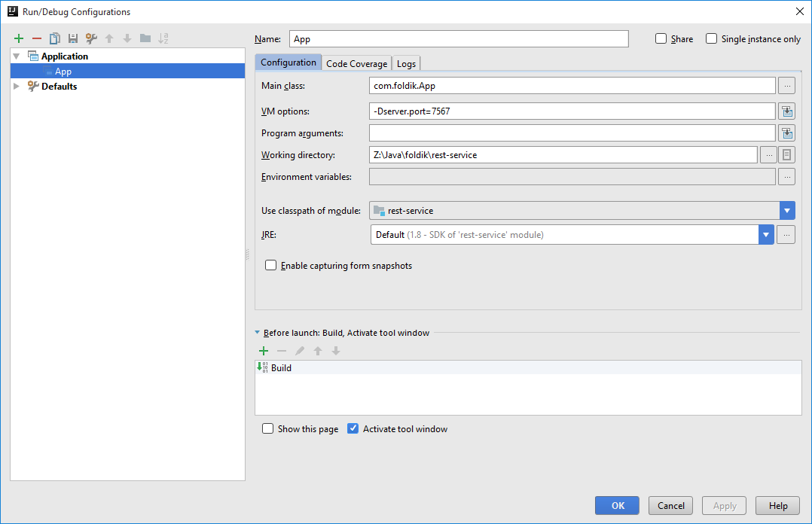

# Rest services example app

## Basic rest endpoint

Note: use AltGr+7 to format java code in markdown language.

1. Create a basic Spring Boot application.

```java
package com.foldik;

import org.springframework.boot.SpringApplication;
import org.springframework.boot.autoconfigure.SpringBootApplication;

@SpringBootApplication
public class App {

    public static void main(String[] args) {
        SpringApplication.run(App.class, args);
    }
}
```

2. Create a simple endpoint which returns "Hello"

```java
package com.foldik.controllers;

import org.springframework.web.bind.annotation.RequestMapping;
import org.springframework.web.bind.annotation.RestController;

@RestController
public class BasicRestController {

    @RequestMapping("/hello")
    public String hello() {
        return "Hello";
    }
}
```

3/a. Create some configs in the ```src/main/resources/application.properties```:

```
server.port=8999
```

3/b. Or add some configs via JVM properties:



Try it: 

```curl -sb -H "Accept: application/json" http://localhost:7567/hello```

## GoT Girls Enpoint

1. Create some model objects like ```GotGirl.java``` and ```Book.java```.

2. Create a rest controller to serve the data.

Note: Here the controller will wait for a list of got girls (because of the constructor with the ```@Autowired``` annotation) so we should provide this from a config class.

```java
package com.foldik.controllers;

import com.foldik.model.GotGirl;
import org.springframework.beans.factory.annotation.Autowired;
import org.springframework.web.bind.annotation.RequestMapping;
import org.springframework.web.bind.annotation.RestController;

import java.util.List;

@RestController
public class GotGirlsController {

    private List<GotGirl> gotGirls;

    @Autowired
    public GotGirlsController(List<GotGirl> gotGirls) {
        this.gotGirls = gotGirls;
    }

    @RequestMapping("/gotGirls")
    public List<GotGirl> listAllGotGirls() {
        return gotGirls;
    }
}
```
3. Create a config class, where we provide the List<GotGirl> as a **_Spring Bean_**.

Note: Spring will care with class because of the ```@Configuration``` annotation.

```java
package com.foldik.config;

import com.foldik.model.Book;
import com.foldik.model.GotGirl;
import org.springframework.context.annotation.Bean;
import org.springframework.context.annotation.Configuration;

import java.time.LocalDate;
import java.util.ArrayList;
import java.util.Arrays;
import java.util.List;

import static java.util.Arrays.asList;

@Configuration
public class AppConfig {

    @Bean
    public List<GotGirl> gotGirls() {
        List<GotGirl> gotGirls = new ArrayList<>();
        gotGirls.add(new GotGirl("Sansa Stark", "90D", 21, asList(new Book("GoT 2", LocalDate.now()))));
        return gotGirls;
    }
}
```
Try it: 

```curl -sb -H "Accept: application/json" http://localhost:7567/gotGirls | json_pp```

```json
[
   {
      "books" : [
         {
            "title" : "GoT 2",
            "publicationDate" : {
               "monthValue" : 7,
               "chronology" : {
                  "calendarType" : "iso8601",
                  "id" : "ISO"
               },
               "dayOfMonth" : 18,
               "dayOfWeek" : "TUESDAY",
               "dayOfYear" : 199,
               "month" : "JULY",
               "era" : "CE",
               "leapYear" : false,
               "year" : 2017
            }
         }
      ],
      "name" : "Sansa Stark",
      "age" : 21,
      "chestSize" : "90D"
   }
]
```

## GoT Girls find by id

Created a new endpoint which returns the requested GotGirl.

```java
@RequestMapping("/gotGirl/{id}")
public GotGirl listAllGotGirls(@PathVariable("id") Integer id) {
    for (GotGirl gotGirl : gotGirls) {
        if (gotGirl.getId() == id) {
            return gotGirl;
        }
    }
    throw new IllegalArgumentException("Got girl not found with id: " + id);
}
```

## Simple POST example

Created a simple endpoint with post mapping.

```java
package com.foldik.controllers;

import org.slf4j.Logger;
import org.slf4j.LoggerFactory;
import org.springframework.web.bind.annotation.PostMapping;
import org.springframework.web.bind.annotation.RequestBody;
import org.springframework.web.bind.annotation.RestController;

@RestController
public class SimplePostController {

    private static final Logger LOGGER = LoggerFactory.getLogger(SimplePostController.class);

    @PostMapping("/simplePost")
    public String postMessage(@RequestBody String message) {
        LOGGER.info(message);
        return "OK";
    }
}
```

Try it:

```curl -X POST -d @request.txt http://localhost:7567/simplePost```

## Call them with RestTemplate

### Call gotGirl/1 from rest template

```java
package com.foldik.endpointcaller;

import com.foldik.model.GotGirl;
import org.springframework.web.client.RestTemplate;

public class GotGirlsCaller {

    private RestTemplate restTemplate;

    public GotGirlsCaller(RestTemplate restTemplate) {
        this.restTemplate = restTemplate;
    }

    public GotGirl getFirstGotGirl() {
        return restTemplate.getForObject("http://localhost:7567/gotGirl/1", GotGirl.class);
    }
}
```

```java
package com.foldik.config;

import com.foldik.endpointcaller.GotGirlsCaller;
import com.foldik.endpointcaller.TryOutCaller;
import com.foldik.model.Book;
import com.foldik.model.GotGirl;
import org.springframework.beans.factory.annotation.Autowired;
import org.springframework.context.annotation.Bean;
import org.springframework.context.annotation.Configuration;
import org.springframework.core.env.Environment;
import org.springframework.web.client.RestTemplate;

import java.time.LocalDate;
import java.util.ArrayList;
import java.util.List;

import static java.util.Arrays.asList;

@Configuration
public class AppConfig {

    @Autowired
    private Environment environment;

    @Bean
    public List<GotGirl> gotGirls() {
        List<GotGirl> gotGirls = new ArrayList<>();
        gotGirls.add(new GotGirl(1, "Sansa Stark", "90D", 21, asList(new Book("GoT 2"))));
        gotGirls.add(new GotGirl(2, "Amanda Stark", "80B", 18, asList(new Book("GoT 1"))));
        return gotGirls;
    }

    @Bean
    public RestTemplate restTemplate() {
        return new RestTemplate();
    }

    @Bean
    public GotGirlsCaller gotGirlsCaller() {
        return new GotGirlsCaller(restTemplate());
    }

    @Bean
    public TryOutCaller tryOutCaller() {
        return new TryOutCaller(environment.getRequiredProperty("rest.service.try.something.url"), restTemplate());
    }
}
```
### Call a random url

```java
package com.foldik.endpointcaller;

import org.springframework.web.client.RestTemplate;

public class TryOutCaller {

    private String url;
    private RestTemplate restTemplate;

    public TryOutCaller(String url, RestTemplate restTemplate) {
        this.url = url;
        this.restTemplate = restTemplate;
    }

    public String tryOutSomething() {
        return restTemplate.getForObject(url, String.class);
    }
}
```

```
server.port=7567
rest.service.try.something.url=http://www.something.hu
```

## Return Got Girls in XML


# Useful notes

```find .git```: list all files in .git folder

Check Joda Time and the java Time API!!!


Check some useful [Spring web annotation](https://docs.spring.io/spring-framework/docs/current/javadoc-api/org/springframework/web/bind/annotation/package-summary.html)!